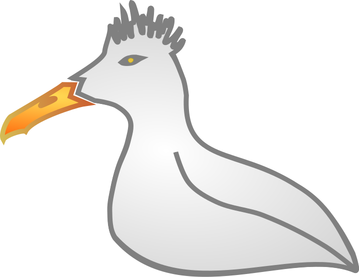

name: inverse
layout: true
class: center, middle, inverse
---
#GoéLUG
[Goéland + Linux User Group]

.photo1[]

.footnote[Site web: [www.goélug.org](http://www.goelug.org)]
---
layout: false
.left-column[
  ## GoéLUG
]
.right-column[
  # L'association GoéLUG

- Promouvoir l'utilisation des logiciels libres
- Démocratiser les technologies de l’Internet
- Echanger autour de la culture libre et de l’art libre
- Fonctionnement avec un conseil collégial

.photo1[]
]
