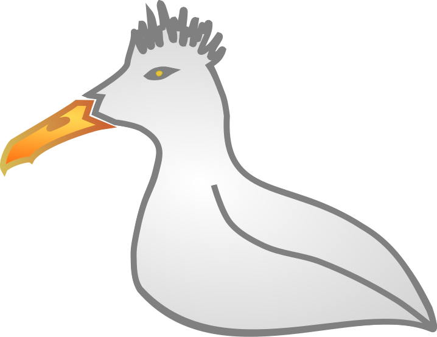

name: inverse
layout: true
class: center, middle, inverse
---
#GoéLUG
[Goéland + Linux User Group]

.photo1[]

.footnote[Site web: [www.goélug.org](http://www.goelug.org)]
---
layout: false
.left-column[
  ## GoéLUG
]
.right-column[
  # L'association GoéLUG

- Fonctionnement avec un conseil collégial
- Promouvoir l'utilisation des logiciels libres
- Démocratiser les technologies de l’Internet
- Echanger autour de la culture libre et de l’art libre

.photo1[]
]
---
.left-column[
  ## GoéLUG
  ## Logiciel libre ?
]
.right-column[
# Les logiciels libres, c'est quoi ?

### Le logiciel libre est défini par les quatre libertés des licences libres :
- Liberté #0: utiliser le logiciel sans restrictions
- Liberté #1 : voir le code du logiciel pour l'étudier
- Liberté #2 : Modifier le logiciel pour ajouter des fonctionnalités ou corriger des erreurs
- Liberté #3 : Partager le logiciel avec (ou sans) modifications
]

???
Des utilisateurices réclament des définitions plus exigeantes du logiciel libre.
Par exemple, la prise en charge des personnes étant en situation de handicap
(ces définitions peuvent être elles-mêmes enrichies).
---
.left-column[
  ## GoéLUG
  ## Logiciel libre ?
  ## Evénements
]
.right-column[
 # Événements déjà réalisés
### Install parties
Installation et prise en main
Support (dépannage, mises à niveau …)
.photo1[]

### Goébidouille
Sujets variés autour du libre
- Raspberry PI
- Arduino
- Auto hébergement

.photo2[]
.photo3[]
]

---

.left-column[
  ## GoéLUG
  ## Logiciel libre ?
  ## Evénements
  ## Le Container
]

.right-column[
  # Pourquoi le Container ?

## Aspect Loco
 - Numérique

## Aspect Co-working
- Ne pas partir de zéro (le but initial de Linus Torvald)
- Partage des informations
- Défense des libertés des utilisateurices (point de vue de Richard Stallman et de la FSF)
- Le logiciel libre est social depuis le départ (les premiers réseaux sociaux avant Facebook, Twitter…).
]
---
.left-column[
  ## GoéLUG
  ## Logiciel libre ?
  ## Evénements
  ## Le Container
  ## Proposition
]
.right-column[
 # Premières propositions

## Evénement régulier
- A une date fixe
 - 1er jeudi du mois
- Ouvert a tout le monde
 - ~5 Visiteurs
 - Possibilité d'intervenant 1er sujet : FAI associatif

> Informel

## Sujets variés
 - Cryptoparty
 - Mini install party
 - Auto hébergement
 - Multimédia
]
---
name: inverse
layout: true
class: center, middle, inverse
---
#A bientôt!